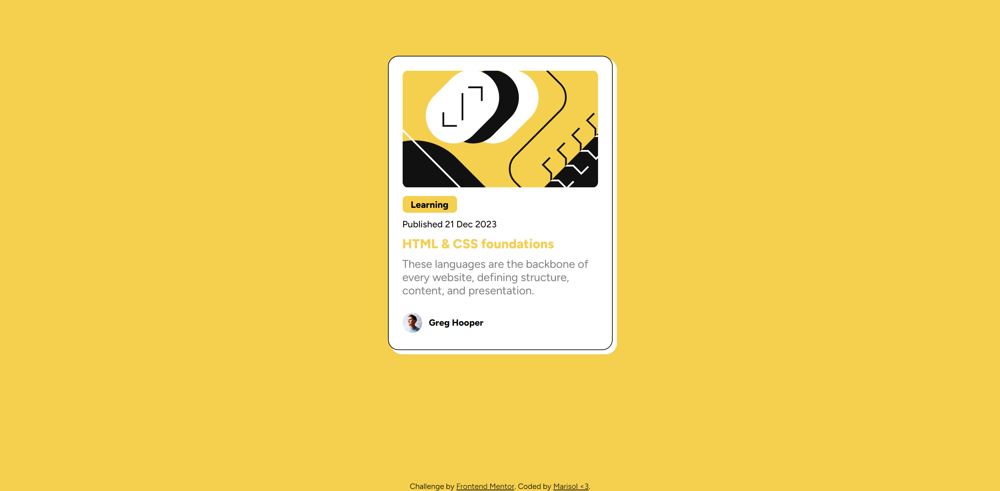

# Frontend Mentor - Blog preview card solution

This is a solution to the [Blog preview card challenge on Frontend Mentor](https://www.frontendmentor.io/challenges/blog-preview-card-ckPaj01IcS). Frontend Mentor challenges help you improve your coding skills by building realistic projects. 

## Table of contents

- [Overview](#overview)
  - [The challenge](#the-challenge)
  - [Screenshot](#screenshot)
  - [Links](#links)
- [My process](#my-process)
  - [Built with](#built-with)
  - [What I learned](#what-i-learned)
  - [Continued development](#continued-development)
  - [Useful resources](#useful-resources)
- [Author](#author)

## Overview
this is the second challenge from Frontend Mentor that i've done. I added animation all over the diferent elements of the card. 
i strugle a lot with positioning elements on the page.

### The challenge

Users should be able to:

- See hover and focus states for all interactive elements on the page

### Screenshot

.png)

### Links

- Solution URL: [Add solution URL here](https://your-solution-url.com)
- Live Site URL: [Add live site URL here](https://your-live-site-url.com)

## My process
1 . first i worked with the html code to separate each section of the card to do this i used grid
2 . i tried to recreate the style with css the most loyal posible
3 . i was not sure of what elements of the card i had to animate so i added a little animation to almost all of them.
### Built with

- Semantic HTML5 markup
- CSS custom properties
- CSS Grid

### What I learned

- learned more of grid system
- structure better html
- color choices
- to do fun animations

### Useful resources

- just brave search 

## Author

- Website - [Marisol Vargas](https://www.github.com/katherina-00)
- Frontend Mentor - [@katherina-00](https://www.frontendmentor.io/profile/katherina-00)
- Linkedin - [Marisol Vargas](https://www.linkedin.com/in/marisol-vargas-in/)